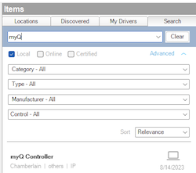
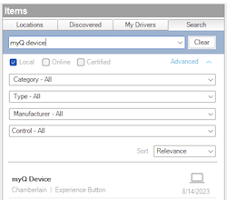

---

# Overview

> DISCLAIMER: This software is neither affiliated with nor endorsed by either
> Control4 or Chamberlain.

Easily integrate myQ garage doors and gates into Control4 without the need of
additional hardware or manual wiring to the controller. This driver connects to
a myQ cloud account, discovers the devices and makes them available to the
Control4 project.

# System requirements

- Control4 OS 3.3+

# Features

- Supports all known myQ compatible garage doors and gates
- Supports shared account devices
- Automatic updates
- Easy and maintenance free installation

# Driver Setup

Driver installation and setup is similar to most other cloud based drivers.
Below is an outline of the basic steps for your convenience.

1. Download the `control4-myq.zip` from the
   [latest GitHub release](https://github.com/black-ops-drivers/control4-myq/releases/latest).
2. Extract and
   [install](<(https://www.control4.com/help/c4/software/cpro/dealer-composer-help/content/composerpro_userguide/adding_drivers_manually.htm)>)
   the `myq_controller.c4z` and `myq_device.c4z` drivers.
3. Use the "Search" tab to find the "myQ Controller" driver and add it to your
   project.

   > ⚠️ Only a **_single_** controller driver instance is required per myQ
   > account.

   

4. Configure the [myQ Settings](#myq-settings) with the account information.
5. After a few moments the [`Driver Status`](#driver-status-read-only) will
   display `Connected`. If the driver fails to connect, set the
   [`Log Mode`](#log-mode--off--print--log--print-and-log-) property to `Print`
   and re-set the [`Email`](#email) field to trigger a reconnect. Then check the
   lua output window for more information.
6. Once connected, the "Connections" window for the driver will display all
   compatible devices on the account.
7. Use the "Search" tab again to find the "myQ Device" driver and add one
   instance to the project for each myQ device you want to integrate. Don't
   worry about naming them as they will auto-rename to the name of the myQ
   device once connected. This can be turned off in the myQ Device driver
   properties.

   

8. Connect the myQ Device drivers to the myQ Controller driver in the
   "Connections" window.

## Driver Properties

### Cloud Settings

##### Automatic Updates

Turns on/off the GitHub cloud automatic updates.

##### Update Channel

Sets the update channel for which releases to consider during an automatic
update from the GitHub repo releases.

### Driver Settings

##### Driver Status (read only)

Displays the current status of the driver.

##### Driver Version (read only)

Displays the current version of the driver.

##### Log Level [ Fatal | Error | Warning | **_Info_** | Debug | Trace | Ultra ]

Sets the logging level. Default is `Info`.

##### Log Mode [ **_Off_** | Print | Log | Print and Log ]

Sets the logging mode. Default is `Off`.

### myQ Settings

##### Email

Sets the myQ email address.

##### Password

Sets the myQ password.

## Driver Actions

#### Refresh Devices

Trigger the driver to refresh all devices and statuses from the configured myQ
account. Any added/removed devices will be added/removed from the driver
connections.

#### Update Drivers

Update the controller and device drivers from the
[latest GitHub release](https://github.com/black-ops-drivers/control4-myq/releases/latest).

# Support

If you have any questions or issues integrating this driver with Control4 you
can file an issue on GitHub:

https://github.com/black-ops-drivers/control4-myq/issues/new

# Changelog

[//]: # "## v[Version] - YYY-MM-DD"
[//]: # "### Added"
[//]: # "- Added"
[//]: # "### Fixed"
[//]: # "- Fixed"
[//]: # "### Changed"
[//]: # "- Changed"
[//]: # "### Removed"
[//]: # "- Removed"

## v20230829 - 2023-08-29

### Added

- Added `Still Open` event for the device, configured by the
  `Still Open Time (s)` property.

## v20230823 - 2023-08-23

### Fixed

- Fixed login issue where the wrong response was used to determine if the
  credentials were valid.

## v20230822 - 2023-08-22

### Added

- Initial release.
